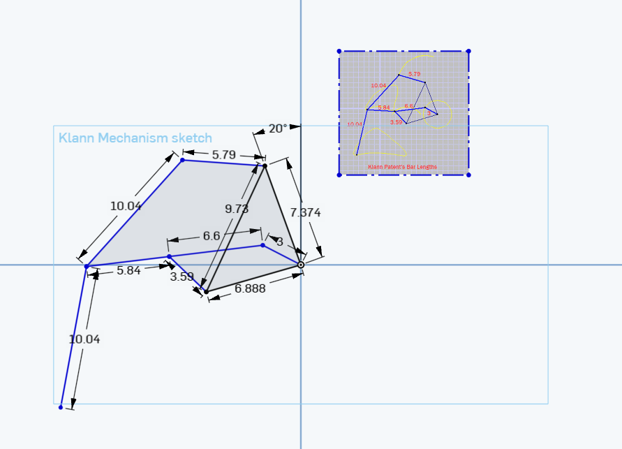
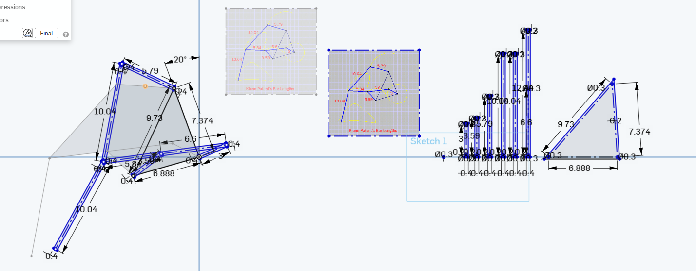
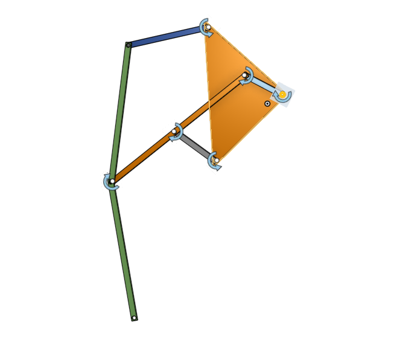
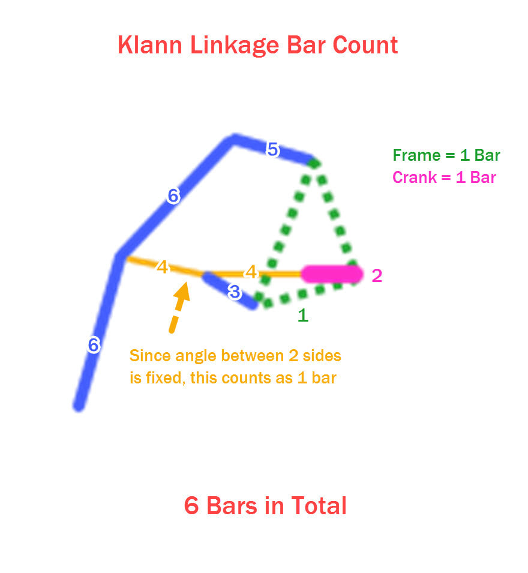
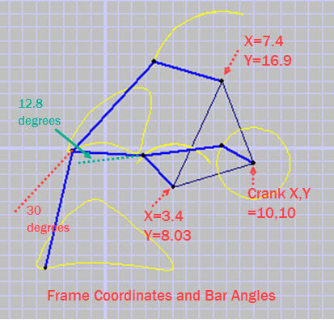

# Spiderbot Journal

This is the journal of everything I've done for this project!!!

# Entry 1

### I prototyped and built an initial draft of my leg mechanism!

To make it, I looked into the basics of mechanisms and found some nice videos on them! After messing around a bit to get the feel of mechanism sketches in CAD I tried to build "klann linkage". A "klann linkage" is a linkage I found online designed to move like a leg. I failed quite badly.

Eventually I found some dimensions and made it with those. After a long while I got working sketch!

Then I had to make rectangles, I started off doing it on old lines but I ended up just moving them separate. After a while I got them in 3d and assembled them to create a working "klann linkage"!!!

Overall I think I learned a lot about mechanisms,

Todo:

1. Look into motors to figure out lengths/scale.
2. Decide whether to use gears (and learn how to CAD them :sob:) or have a motor with a bar on it already.
3. CAD case and everything else

### Current progress:

Lapse: https://lapse.hackclub.com/timelapse/S2aZE7JQY81K

**Time Spent: 2 hrs 35 min**

# Entry 2

### Redid Legs and fixed angles and measurements (_hopefully...)_

For some reason I decided it was a good idea to redo the legs in a different cad file :pf: but it ended up working out for the best.

After redoing the parts in a (imo) much more clean way, the klann linkage was looking a bit off. After playing around with it a bit at school, I realized the angles were off on my 10.04 and 12.44 bar. After looking more closely at my reference images, I realized the 10.04s were supposed to be connected at a 30 degree angles (same w/ 12.44)

So I redid those with the proper angles and that made the klann linkage look much much better!

I also calculated a scale factor so the actual leg would be about 3 servos long in real life. I'm like 95% sure this is the worst way of doing it but.... what's the worse that could happen :pray:

Todo:

1. Gear for the servo
2. Case
3. Arduino R4 hat (or other module)
4. Final CAD assembly
5. Firmware
6. Ship??

The new parts I made (the ones with bends):
.png>)

Lapse: https://lapse.hackclub.com/timelapse/aSGodlJVNzAM and https://lapse.hackclub.com/timelapse/aGhlRFppwOYC

**Time Spent: 2 hrs 1 min**
